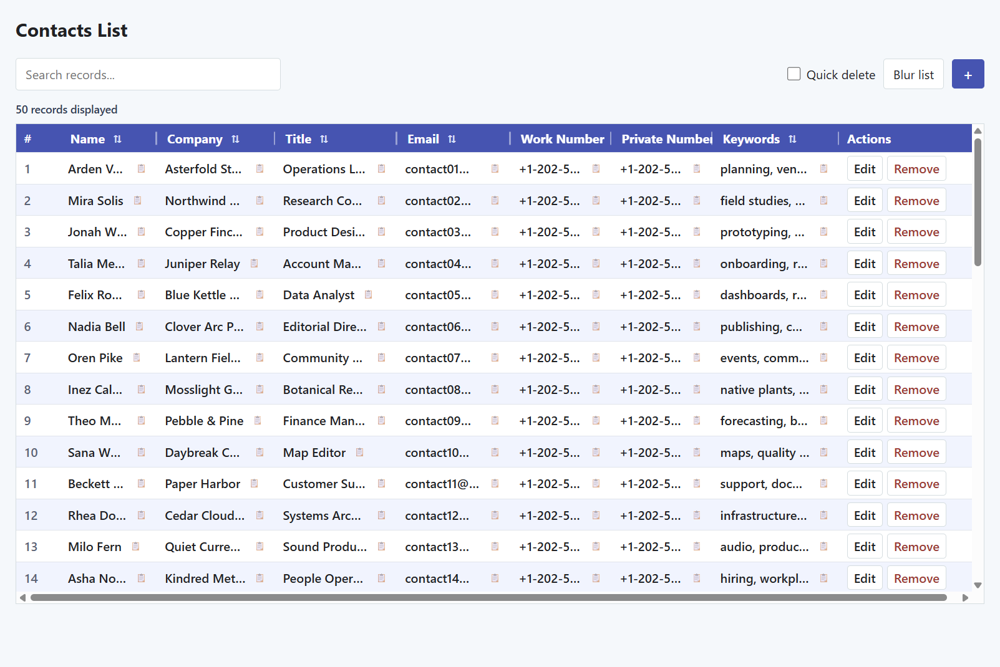

# List Manager

A general-purpose local browser-based manager for schema-driven JSON lists and records. Requires Windows PowerShell 5.1 or PowerShell 7+.



## Start

Run from the project folder:

```powershell
.\Start-WebServer.ps1
```

Open the localhost URL printed by the server (default port `8080`). Add `-OpenBrowser` to launch it automatically. `-Root .` serves files from the current folder.

## Options

```powershell
.\Start-WebServer.ps1 -Port "8080-8090" -DataFile "records.json"
.\Start-WebServer.ps1 -DataFile "records.json.gz" -OpenBrowser
```

- `-Port 8080` tries one port. `-Port "8080-8090"` advances sequentially when a port is occupied.
- Without `-DataFile`, the list defaults to `data.json.gz` when present, then falls back to `data.json`. Saves update only the format loaded.
- An explicit `.json` or `.gz` file is read and updated on its own. Data-file paths are relative to the server root and cannot escape it.
- `-EditPassword` protects saves, not reads. `-AllAddresses` exposes the server to the network and may require a Windows URL reservation.
- `-AllowClientExit` lets closing or navigating away from the page stop the server.

## Use

- Search records, sort by column, drag dividers to resize, or copy a field value.
- Use **+** to add a record, **Edit** to change one, and **Remove** to delete one. **Quick delete** skips confirmation.
- Use **Edit columns** in the columns row (the pencil button beside the Actions caption) to add a column, rename it, change its type or required flag, or remove it and its values. Column keys stay stable so renaming never loses data.
- A list with no columns opens in column edit mode with a hint banner; add the first column to get started.
- **RTL** mirrors the whole list right-to-left, including column dividers and drag resizing. The choice is remembered per browser.
- **Blur list** visually obscures record fields; it does not encrypt or protect the underlying data.

Edits save to the selected JSON file or gzip file. Press `q` in the server terminal to stop it; Enter is not needed.
